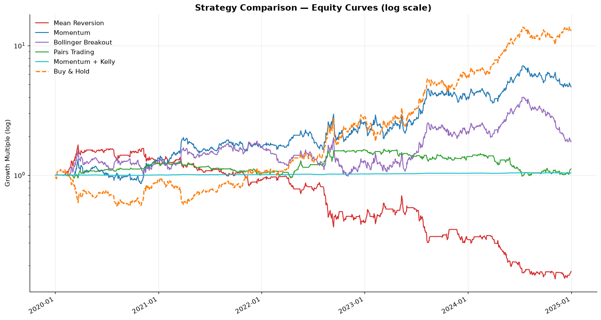

# Trading Strategy Research (Learning Project)

This is a learning/practice repo, not a production trading system. Before building the strategy engine layer for my main project (a low-latency C++ trading engine), I wanted to get hands-on with the quant/strategy side of things — backtesting basic strategies in Python, computing the usual risk metrics, and learning to read equity curves.

So this repo is four classic strategies tested on the same BIST stock (GARAN.IS, 2020-2025), plus a Kelly/volatility-adjusted position-sizing layer on top of the best performer, just to see how they behave and to practice the tooling (pandas, matplotlib, basic backtesting logic). It's intentionally simple — no parameter optimization, no walk-forward validation, no claim that any of this is tradeable. The point was learning the workflow end to end: generate a signal, backtest it, compute Sharpe/drawdown/win rate, plot it, and actually understand what the numbers mean.

I plan to keep doing this with other instruments/strategies as I learn more, before eventually moving on to designing the strategy engine for the real project.

## Strategies

- **Mean Reversion** (z-score) 
- **Momentum** (MA crossover) 
- **Bollinger Breakout** 
- **Pairs Trading** (GARAN.IS / AKBNK.IS) 
- **Kelly + volatility-adjusted sizing** — (with the best strategy (Momentum)) 

## Data & setup

- GARAN.IS (Garanti BBVA, BIST), 2020-01-01 to 2025-01-01, plus AKBNK.IS for pairs trading
- 5 bps transaction cost per position change
- Fixed position sizing (-1 / 0 / +1) except for the Kelly strategy
- Sharpe annualized with `sqrt(252)`, max drawdown = worst peak-to-trough drop in equity, win rate = % of active days with positive return

## Results



| Strategy | Sharpe | Max Drawdown | Win Rate | Total Return |
|---|---|---|---|---|
| Mean Reversion | -0.66 | -90.8% | 47.9% | -81.9% |
| Momentum | 0.93 | -38.8% | 50.2% | 380.5% |
| Bollinger Breakout | 0.49 | -54.8% | 47.9% | 80.8% |
| Pairs Trading | 0.21 | -38.2% | 50.7% | 11.6% |
| Momentum + Kelly | 0.93 | -0.8% | 50.2% | 3.9% |

## What I took away from this

- All five curves move together until ~2022, then GARAN.IS goes into a strong uptrend and they split hard. Mean reversion bets against the trend and loses badly; momentum rides it and wins. Same data, opposite assumption, opposite result — that was the most useful thing to actually see rather than just read about.
- Win rate doesn't have to be high to be profitable. Momentum won barely more than half its days (50.2%) but still had the best return, because the wins were bigger than the losses.
- Pairs trading and the Kelly-sized momentum strategy both stay close to flat on the chart — by design, since one is market-neutral and the other has its position size cut to ~5.5% of capital. Useful to see that "low risk" visually means "barely moves."
- Kelly sizing didn't improve Sharpe at all, it just shrank the position — drawdown went from -38.8% to -0.8%, but return went from 380.5% to 3.9%. Cutting risk isn't free, it's a direct trade against the upside.

## Limitations (i.e. why this isn't a real strategy)

- One stock pair, one time period, no out-of-sample testing
- Window sizes and thresholds were picked once and not tuned
- Transaction costs are a flat estimate, not realistic slippage/market impact
- No regime detection — a real system would need to know it's in a trending vs. ranging market, not find out after the fact by looking at a chart

## Structure

```
trading-strategy-research/
├── common/
│   ├── data_loader.py       # fetch + cache price data for any ticker
│   └── plot_utils.py        # shared plot styling
├── data/                       # cached price CSVs
├── strategies/
│   ├── 01_mean_reversion/
│   ├── 02_momentum_ma_crossover/
│   ├── 03_bollinger_breakout/
│   ├── 04_pairs_trading/
│   └── 05_vol_adjusted_sizing/
└── comparison/
    └── compare_all.py        # runs all 5, builds the comparison chart + summary table
```
